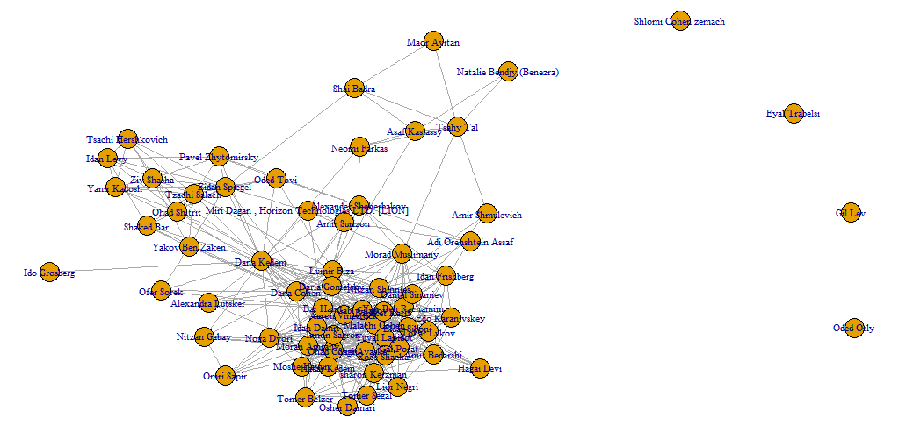
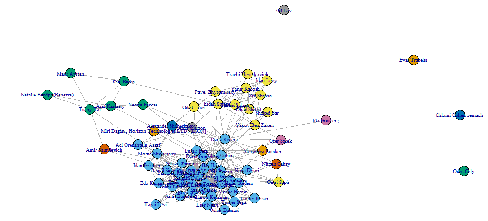
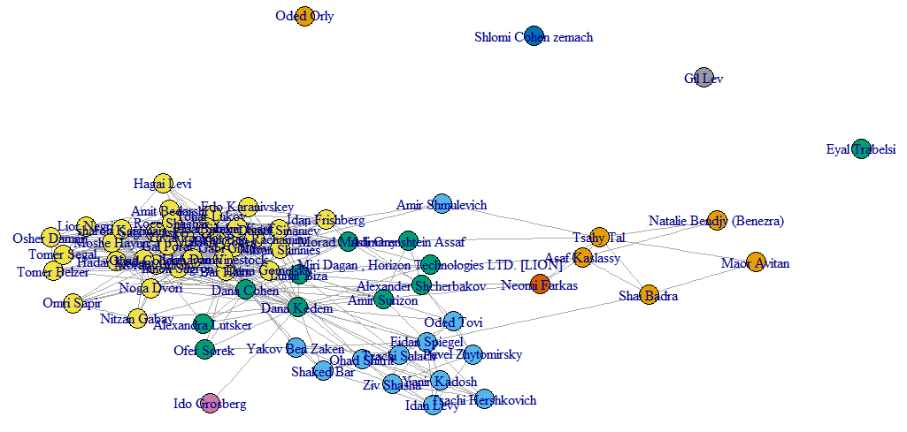

As part of the assignment, we decided to analyze our "Linkedin" network.

Each vertex in the graph represents a Linkedin user, and each edge represents connection between the two users in the Linkedin network.

This is the initial Graph:

```{r eval=FALSE}
library(igraph)
linkedinGraph <- read.graph(file = "LinkedinGraph.gml",format = "gml")
linkedinGraph$layout <- layout.fruchterman.reingold(linkedinGraph) 
plot(linkedinGraph,vertex.size=5,vertex.label.cex =0.7,asp=FALSE)
```



We computed the centrality attributes of each vertex by the following lines:

```{r eval=FALSE}
V(linkedinGraph)$Betweeness = betweenness(linkedinGraph)
V(linkedinGraph)$Closeness = closeness(linkedinGraph)
V(linkedinGraph)$EigenVector = evcent(linkedinGraph)$vector
```

We found the vertex with the best centrality attributes by the following lines:
```{r eval=FALSE}
V(linkedinGraph)$label[which(V(linkedinGraph)$Betweeness == max(betweenness(linkedinGraph)))]
V(linkedinGraph)$label[which(V(linkedinGraph)$Closeness == max(closeness(linkedinGraph)))]
V(linkedinGraph)$label[which(V(linkedinGraph)$EigenVector == max(evcent(linkedinGraph)$vector))]
```

We got the following results: 

1. Highest betweeness centrality: Dana Kedem.
2. Highest closeness centrality: Bar Haim.
3. Highest eigen-vector centrality: Bar Haim.

Dana Kedem is HR recruiters that  connected to most of my Linkedin connections, Bar Haim is university friend and connected to most of the hr recuiters that connected to me and to all my university friends, therefore both Dana and Bar have the best centrality attributes.

### Grivan-Newman algorithm

We decided to analyze once again the graph with Grivan-Newman algorithm, we used the following code lines:

```{r eval=FALSE}
linkedinGraph = simplify(linkedinGraph)

#girvan-newman
ebc <- edge.betweenness.community(linkedinGraph, directed=F)

# color the nodes according to their membership
mods <- sapply(0:ecount(linkedinGraph), function(i){
  g2 <- delete.edges(linkedinGraph, ebc$removed.edges[seq(length=i)])
  cl <- clusters(g2)$membership
  modularity(linkedinGraph,cl)
})
g2<-delete.edges(linkedinGraph, ebc$removed.edges[seq(length=which.max(mods)-1)])
V(linkedinGraph)$color=clusters(g2)$membership

# layout for the graph
linkedinGraph$layout <- layout.fruchterman.reingold
plot(linkedinGraph,vertex.size=5,vertex.label.cex =0.7,asp=FALSE)
```



We can see that we have 3 major communities:

1. Blue - University friends and HR recruiters - 35 nodes.
2. Green - Work Colleagues - 6 nodes.
3. Yellow - Friends from Previous University - 11 nodes.

There are 11 communities that each contains 1 node.

To summarize we got 17 communities(there are a lot of communities also because the isolated vertexes) with modularity of 0.1856942.

### Walk Trap

The second algorithm we used to analyze the network is Walk Trap.
Here we can see the code:
```{r eval=FALSE}
wtc <- walktrap.community(linkedinGraph)
memb <- cutat(wtc, steps= which.max(wtc$modularity)-1)
plot(linkedinGraph, layout=layout.fruchterman.reingold, vertex.size=5, vertex.color=memb, asp=FALSE)
```


Within this graph we see 4 major communities:

1. Blue - Friends from Previous University - 11 nodes.
2. Orange - Work Colleagues - 5 nodes.
3. Green - HR recruiters - 10 nodes.
4. Yellow - University friends - 33 nodes.

There are 7 communities each contains 1 node.

From our point of view, it's looks like the walk-trap algorithm succeed better than the girvan-newman algorithm, and the communities  diversity is more accurate.

With the walk-trap algorithm we got 11 communities(including the isolated nodes).

We got the following modularity value: 0.2342334.
